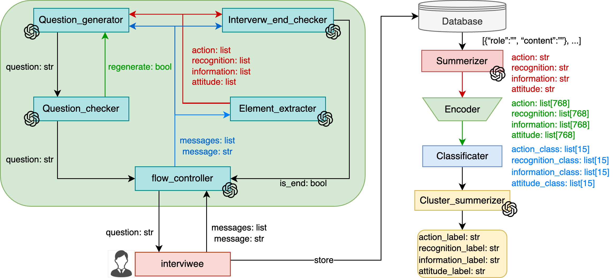
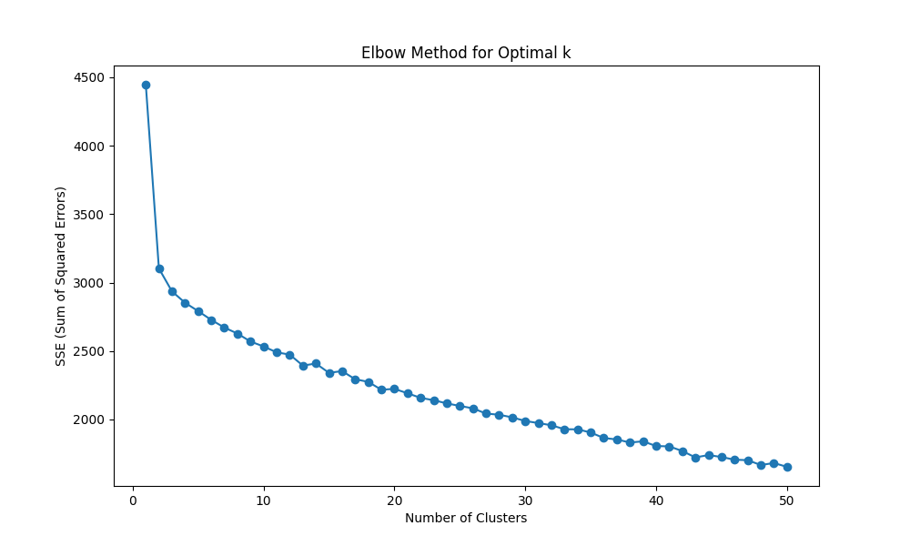
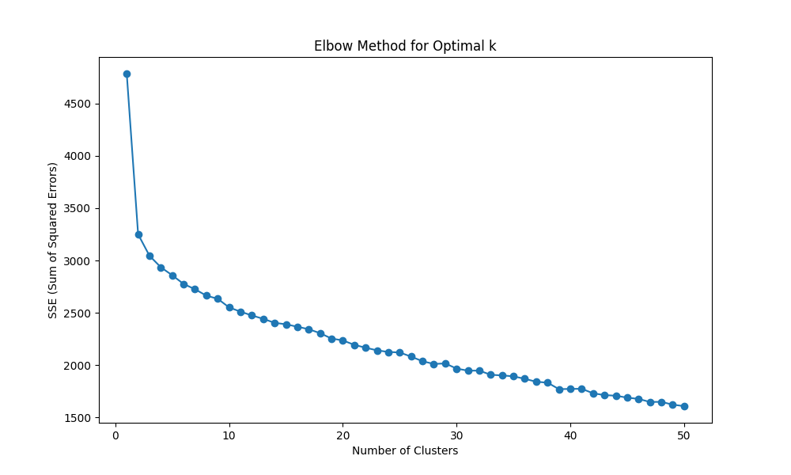
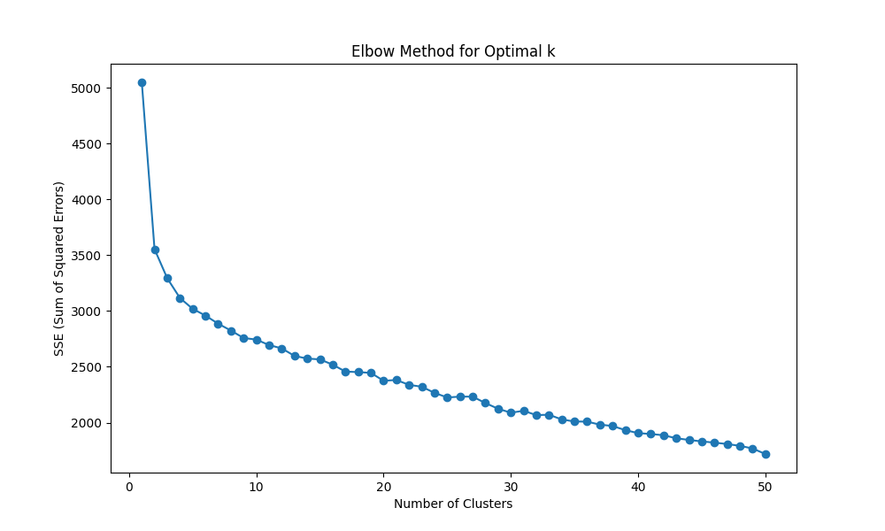
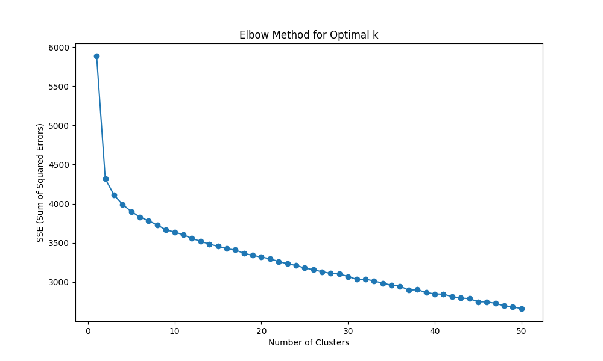

# jp_bert_embedding

## overview
1. model architecture
    
    - LLM model: gpt-4o
    - Database: MongoDB
    - Encoder model: [ScentenceTransformer](https://sbert.net)
    - Classificater: k-means

## quantitive result
1. classification sse plot
<div style="display: flex; flex-wrap: wrap;">
    <div style="flex: 1; margin: 10px; max-width: 50%;">
        <h3>action_sse</h3>
        
    </div>
    <div style="flex: 1; margin: 10px; max-width: 50%;">
        <h3>attitude_sse</h3>
        
    </div>
    <div style="flex: 1; margin: 10px; max-width: 50%;">
        <h3>information_sse</h3>
        
    </div>
    <div style="flex: 1; margin: 10px; max-width: 50%;">
        <h3>recognition_sse</h3>
        
    </div>
</div>

## setup
```sh
git clone git@github.com:aqua-pigeon/embed_models.git
cd embed_models
pyenv install 3.8.10
pyenv local 3.8.10 embmodel
pyenv activate jbe
pip install -r requirements.txt
```

## prepare data
1. download stopwords
    ```sh
    wget http://svn.sourceforge.jp/svnroot/slothlib/CSharp/Version1/SlothLib/NLP/Filter/StopWord/word/Japanese.txt -O data/stopwords.txt
    ```
    place stopwords.txt at `data/stopwords.txt`

2. download interview history  
place interview history at `data/interview_history.csv`
    - [src/sample_messages.json](src/sample_messages.json)
